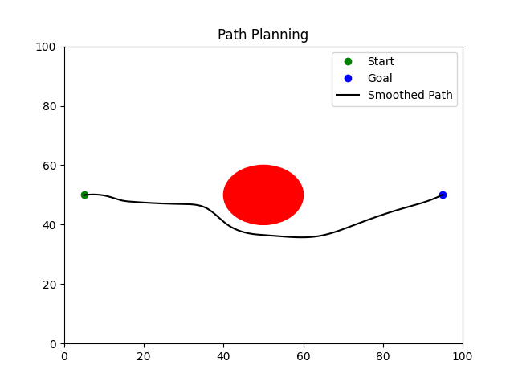
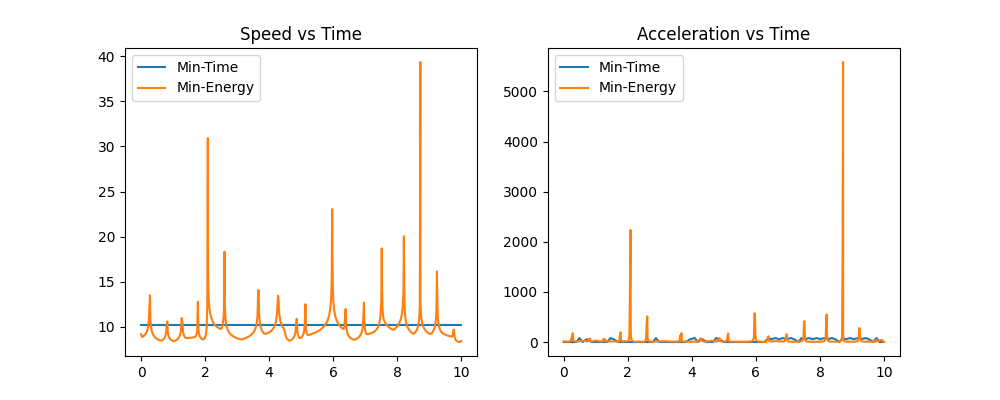

# Formation-Based UAV Path Planning

## The Project

This project implements a multi-UAV formation flight simulation in a 2D environment with obstacle avoidance. The UAV swarm follows a collision-free path generated using the A* path planning algorithm while maintaining a fixed W-shaped formation throughout the mission.

The simulation compares two trajectory types:
- Minimum-Time Trajectory
- Minimum-Energy Trajectory

The system uses 5 UAVs flying from a start point to a goal point while avoiding a circular obstacle.

Important Note: 
1) Minimum Time path is constant velocity path
2) minimum Energy path, conditions are not given properly, hard to figure out. But smoothed out accelerations, so velocity is less at times where turning is needed.
3) Minimum energy path should slow down at sharp turns and speed up on straight segments. I have used this by keeping cetripedal acceleration constant, which can then be kept at any appropriate number to decrease energy as much as one wants. v^2/r is kept constant, where r is the radius of curvature of the path at the point (i used gpt to code this part hehe)

---

# Setup

```bash
git clone  https://github.com/ponishbhatia/UAV_PathPlanning_Simulation.git
cd UAV_PathPlanning_Simulation/end_term
pip install -r requirements.txt
```

---

# To run

```bash
python simulate.py
```

Running the script:
- Generates a collision-free path using A*
- Produces minimum-time and minimum-energy trajectories
- Animates the UAV formation motion
- Saves plots and GIF outputs into the `results/` directory
- Prints trajectory metrics such as total distance, total time, and estimated energy

---

# Role of Each Script

- `map_setup.py` — Defines the 2D environment, obstacle, start point, and goal point
- `path_planner.py` — Implements the A* algorithm for collision-free path planning
- `trajectory.py` — Generates minimum-time and minimum-energy trajectories
- `formation.py` — Defines UAV formation offsets and assigns drones to positions
- `simulate.py` — Runs the complete simulation, animation, and plotting pipeline

---

# Results

## Path Planning Result



---

## Trajectory Comparison



---

## Observations

- The minimum-time trajectory reaches the goal faster but produces larger acceleration spikes due to sharper velocity transitions.
- The minimum-energy trajectory uses smoother velocity scaling, resulting in reduced acceleration peaks and lower estimated control effort.
- The minimum-energy trajectory takes longer to complete but produces more stable motion.

---

# Formation Details

The UAV swarm uses a 5-drone W-shaped formation.

The formation offsets relative to the centroid are:

```python
[
    (-2, 0),
    (-1, -1),
    (0, 0),
    (1, -1),
    (2, 0)
]
```

Each drone maintains a constant offset relative to the formation centroid throughout the flight, ensuring formation preservation during obstacle avoidance and trajectory tracking.

---

# Output Files

The simulation generates the following outputs in the `results/` folder:

- `path_plot.png`
- `trajectory_comparison.png`
- `formation_animation_minimum)_time.gif`
- `formation_animation_minimum_energy.gif`

---

# Dependencies

The project uses the following Python libraries:

- numpy
- matplotlib
- scipy
- pillow

Install them using:

```bash
pip install -r requirements.txt
```