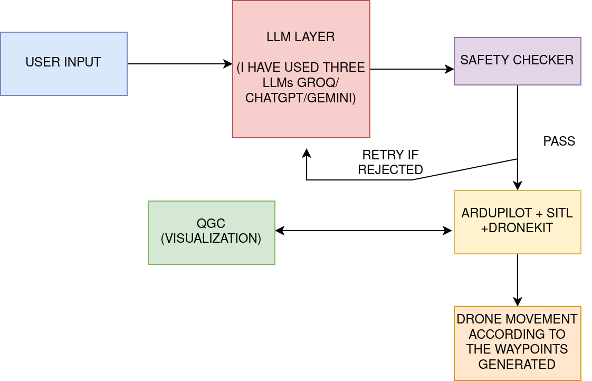
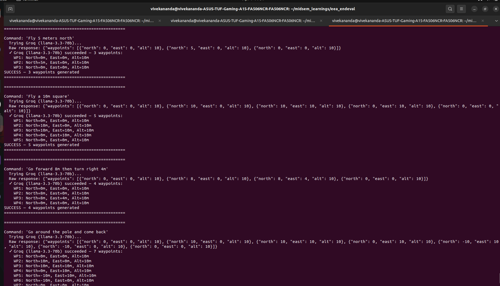
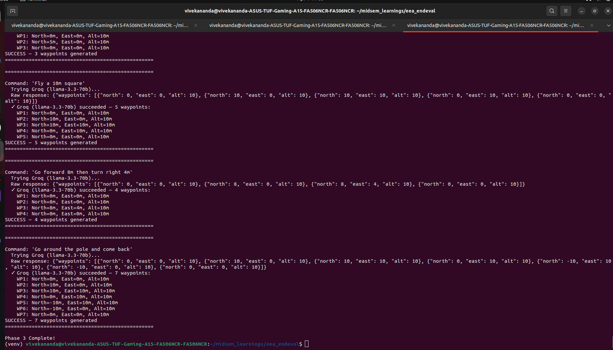
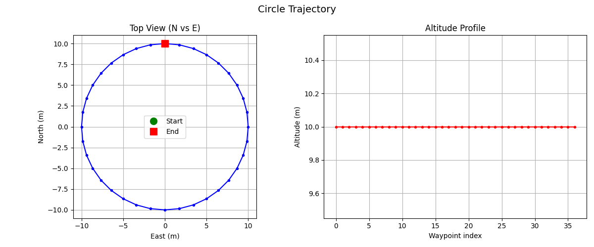
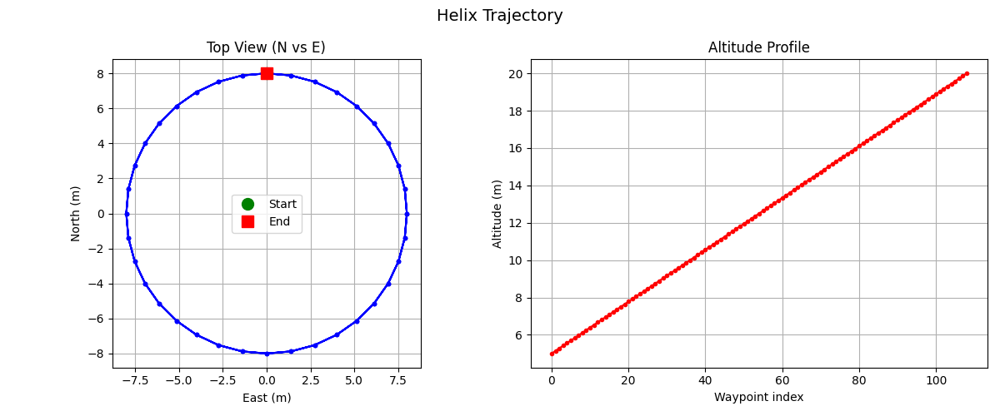
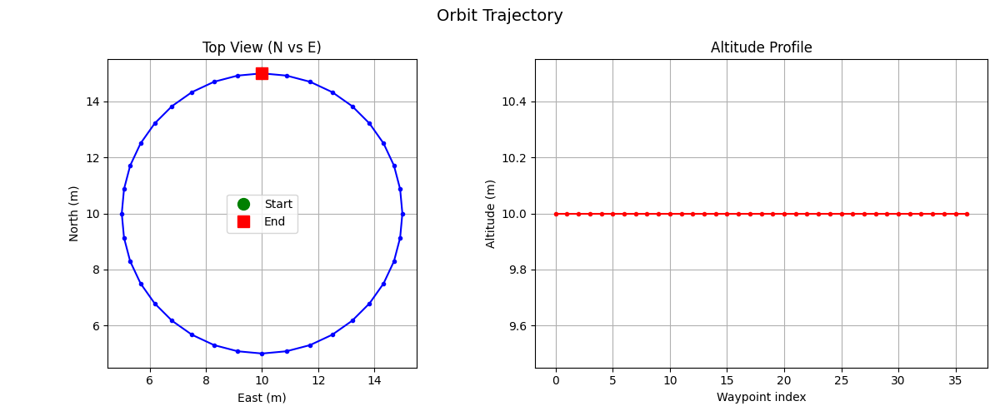
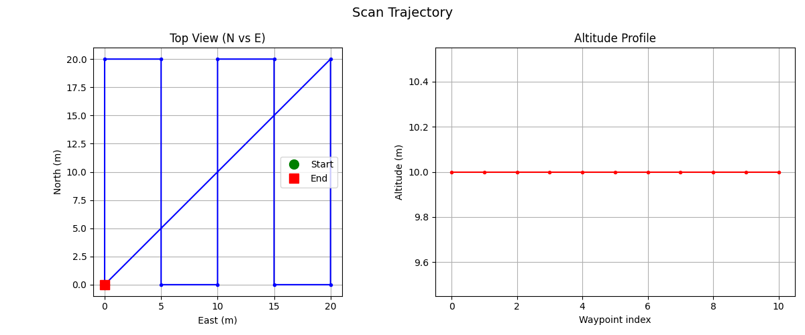
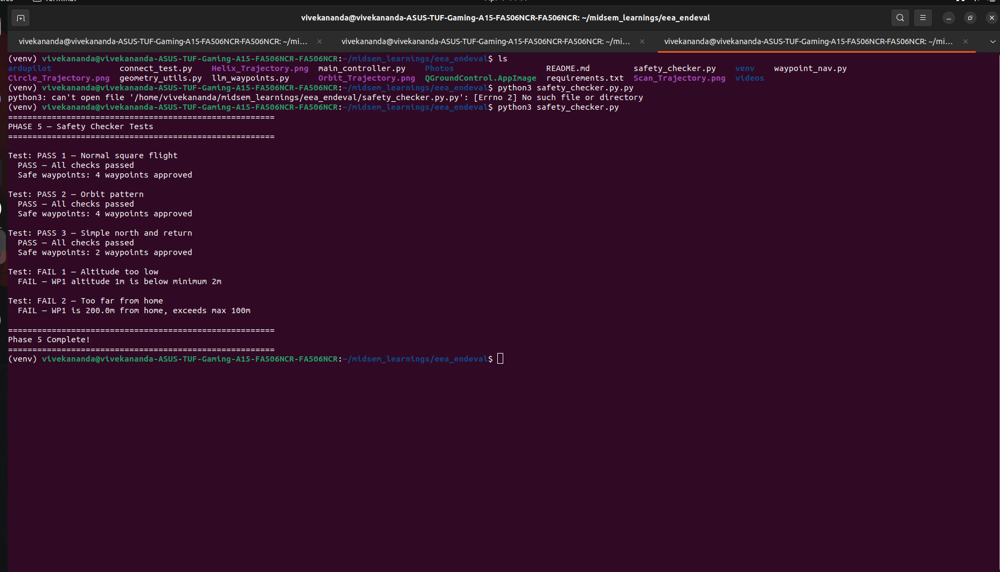

# Natural Language Command & Control for UAVs

**Author:** Mansoju Vivekananda  
**Mentors:** Pratyush Srivastava & Akul Agarwal  
**:** EEA - Electrical Engineers Association, IIT Kanpur  
**Project:** NLP-UAV Final Project (Winter 2025-26)

---

## Overview

This project implements an intelligent drone control system that allows a human operator to issue **natural language commands** - such as *"Go around the pole and come back"* - and have a UAV execute them fully autonomously in simulation.

The system bridges **Generative AI (Large Language Models)** with real-world robotics by connecting an LLM to ArduPilot's flight stack through a validated safety middleware. Commands are interpreted by an LLM, validated by a safety checker, and executed in ArduPilot SITL via DroneKit.

---

## Architecture Diagram



**Flow:** Text Command → LLM interprets & generates JSON waypoints → Safety Checker validates constraints → If rejected, feedback is sent back to LLM (up to 3 retries) → On approval, DroneKit executes mission in ArduPilot SITL → Drone flies waypoints and returns to launch.

---

## Prerequisites

| Requirement | Details |
|---|---|
| **OS** | Linux / WSL|
| **Python** | Python 3.8+ |
| **ArduPilot SITL** | Cloned and built from [ArduPilot GitHub](https://github.com/ArduPilot/ardupilot) |
| **QGroundControl** | [Download AppImage](https://docs.qgroundcontrol.com/master/en/getting_started/download_and_install.html) |
| **API Keys** | At least one of: Groq API key (free), OpenAI API key, or Google Gemini API key |
| **Git** | For cloning and submission |

---

## Installation

### 1. Clone the repository
```bash
git clone https://github.com/electricalengineersiitk/Winter-projects-25-26.git
cd Winter-projects-25-26/YourName_RollNo/NLP-UAV-Project
```

### 2. Create a virtual environment (recommended)
```bash
python3 -m venv venv
source venv/bin/activate
```

### 3. Install Python dependencies
```bash
pip install -r requirements.txt
```

### 4. Set up API keys
Create a `.env` file in the project root:
```env
GROQ_API_KEY=your_groq_api_key_here
OPEN_API_KEY=your_openai_api_key_here
GEMINI_API_KEY=your_gemini_api_key_here
```
> **Note:** You need at least one working API key. Groq is free and recommended as the primary provider.

### 5. Set up ArduPilot SITL
```bash
git clone https://github.com/ArduPilot/ardupilot.git
cd ardupilot
git submodule update --init --recursive
Tools/environment_install/install-prereqs-ubuntu.sh -y
```

---

## How to Run

### Step 1: Launch ArduPilot SITL
Open a terminal and run:
```bash
cd ardupilot/ArduCopter
sim_vehicle.py -v ArduCopter --console --map
```
Wait until the SITL console shows `READY TO FLY`.

### Step 2: (Optional) Launch QGroundControl
In another terminal:
```bash
./QGroundControl.AppImage
```
It will auto-connect to SITL via UDP 14550 for live visualization.

### Step 3: Run the main controller
In a new terminal (with your virtual environment activated):
```bash
python3 main_controller.py
```

### Step 4: Enter natural language commands
Type commands like:
- `Fly a 5 m square and come back`
- `Go around the pole and come back`
- `Fly north 10 meters then hover for 5 seconds`
- `fly at ground level` ← (safety checker will block this)

Type `quit` to exit.

---

## File Descriptions

| File | Description |
|---|---|
| `connect_test.py` | Phase 1 - Connects to SITL, arms the drone, takes off to 10m, hovers for 5 seconds, and lands safely |
| `waypoint_nav.py` | Phase 2 - Flies a 10m × 10m square pattern using GPS waypoints and returns to launch |
| `llm_waypoints.py` | Phase 3 - Sends natural language commands to LLM APIs (Groq → GPT → Gemini fallback) and parses JSON waypoint responses |
| `geometry_utils.py` | Phase 4 - Deterministic trajectory generators (circle, helix, orbit, scan) with matplotlib visualization |
| `safety_checker.py` | Phase 5 - Validates LLM-generated waypoints against altitude, range, obstacle, and return-to-home constraints |
| `main_controller.py` | Phase 6 - Full end-to-end pipeline: text/voice input → LLM → safety validation → DroneKit execution in SITL |
| `voice_input.py` | Bonus - Records audio from microphone and transcribes to text using Groq Whisper API (free) |
| `requirements.txt` | All Python dependencies with version pins |
| `.gitignore` | Excludes API keys, virtual environments, binaries, and cache files |

---

## Phase-by-Phase Breakdown

### Phase 1: Environment Setup (`connect_test.py`)

**Goal:** Get ArduPilot SITL running and connect to it from Python.

**My Approach:**
- Cloned the ArduPilot repository and ran `install-prereqs-ubuntu.sh` to set up the SITL development environment.
- Launched SITL using `sim_vehicle.py -v ArduCopter --console --map` and confirmed the console and map windows opened.
- Installed QGroundControl AppImage and connected it to SITL via UDP port 14550 for live visualization.
- Wrote `connect_test.py` using DroneKit to connect to SITL on `tcp:127.0.0.1:5762`, arm the drone, take off to 10m, hover for 5 seconds, and land safely.

**Checkpoint Evidence:**
- `connect_test.py` runs without errors.
- Video proof of QGroundControl showing the drone airborne: `videos/phase_1_video_proof.mkv`

---

### Phase 2: MAVLink & Waypoint Navigation (`waypoint_nav.py`)

**Goal:** Navigate the drone to multiple waypoints programmatically using MAVLink coordinates.

**My Approach:**
- Studied MAVLink coordinate systems - Global (Lat/Lon/Alt) vs NED (North/East/Down) - and understood when to use each.
- Used `LocationGlobalRelative` with GPS offset calculations: 1 metre North ≈ +0.0000090° latitude, 1 metre East ≈ +0.0000112° longitude.
- Implemented a 10m × 10m square pattern: the drone takes off, flies 4 legs of the square using `simple_goto()`, then returns to launch via RTL mode.
- Added a `wait_until_reached()` helper with a 1.5m tolerance to ensure the drone reaches each waypoint before moving to the next.

**Checkpoint Evidence:**
- `waypoint_nav.py` flies the full square pattern in SITL and returns to home.
- Video proof of QGC showing the path on the map: `videos/phase_2.mkv`

---

### Phase 3: LLM Integration & Prompt Engineering (`llm_waypoints.py`)

**Goal:** Connect to LLM APIs and design prompts that reliably return structured, executable waypoint data.

**My Approach:**
- Set up API access for three LLM providers: **Groq** (free, using LLaMA 3.3 70B), **OpenAI GPT-4o-mini**, and **Google Gemini 2.0 Flash Lite**.
- Designed a strict system prompt that instructs the model to return ONLY raw JSON with NED waypoints - no prose, no markdown, no backticks.
- Built a **multi-API fallback chain** (Groq → GPT → Gemini) so if one API is rate-limited or fails, the system automatically tries the next.
- Added JSON cleanup to strip any accidental markdown formatting (` ```json `) before parsing.
- Tested with all 4 required commands: "Fly 5 meters north", "Fly a 10m square", "Go forward 8m then turn right 4m", and "Go around the pole and come back".

**Checkpoint Evidence:**
- `llm_waypoints.py` accepts any text command and prints a valid parsed JSON waypoint list to the console.
- Screenshots of successful LLM responses:

| Test Run 1 | Test Run 2 |
|---|---|
|  |  |

---

### Phase 4: Trajectory Generation & Geometry (`geometry_utils.py`)

**Goal:** Build deterministic mathematical functions that generate precise, predictable trajectories for abstract maneuver commands.

**My Approach:**
- Implemented **4 trajectory functions** (3 required + 1 advanced):
  - `generate_circle()` - evenly spaced NED waypoints forming a closed circle using parametric equations (cos/sin).
  - `generate_helix()` - rising spiral trajectory with linearly interpolated altitude across multiple laps.
  - `generate_orbit()` - orbit a fixed pole position at a safe standoff radius (the primary use case for "Go around the pole").
  - `generate_scan()` - lawnmower/boustrophedon pattern for area coverage (advanced).
- All functions return lists of NED waypoint dicts `{north, east, alt}` ready for the safety checker and DroneKit.
- Visualized all trajectories using matplotlib with top-view (N vs E) and altitude profile plots.

**Checkpoint Evidence:**
- `geometry_utils.py` contains 4 working trajectory functions.
- matplotlib plots showing the path shapes:

| Circle | Helix | Orbit | Scan |
|--------|-------|-------|------|
|  |  |  |  |

---

### Phase 5: Safety Layer & Constraint Checker (`safety_checker.py`)

**Goal:** Build a middleware validator that blocks all unsafe LLM-generated waypoints before they reach the drone.

**My Approach:**
- Implemented `validate_waypoints()` that checks every waypoint against:
  - **Minimum altitude** (≥ 2m) - prevents ground-level crashes.
  - **Maximum altitude** (≤ 50m) - prevents unreasonable heights.
  - **Maximum range from home** (≤ 100m) - keeps drone within safe operating radius.
  - **Obstacle clearance** (≥ 2m from any obstacle) - avoids collisions.
  - **Return-to-home check** - final waypoint must be within 5m of home position.
- Returns a structured result with `valid` (bool), `reason` (string), and `safe_waypoints` (list).
- If validation fails, the rejection reason can be fed back to the LLM for a revised plan.
- Wrote **5 test cases**: 3 that pass validation and 2 that fail with clear reasons.

**Checkpoint Evidence:**
- Running `safety_checker.py` standalone prints all 5 test results correctly, including the failure reason for the 2 invalid cases.
- Screenshot of test output:



---

### Phase 6: Full Pipeline Integration (`main_controller.py`)

**Goal:** Connect every module into a single working end-to-end system and validate the primary use case.

**My Approach:**
- Created `main_controller.py` as the single entry point that orchestrates the entire pipeline.
- Implemented the complete flow:
  1. Accept a text command from the user (keyboard input).
  2. Send the command to the LLM with the engineered system prompt.
  3. Parse the JSON waypoint response.
  4. Pass waypoints through `validate_waypoints()`. If validation fails, send the reason back to the LLM as context and request a revised plan (retry up to 3 times).
  5. On passing validation, ask user for confirmation, then execute the mission via DroneKit - arm, take off, fly all waypoints, return to launch.
- Uses NED-to-GPS conversion (`get_location_metres()`) to translate waypoints to `LocationGlobalRelative` for DroneKit.
- Includes an interactive loop so the user can issue multiple commands in one session.
- Tested the following commands end-to-end in SITL:
  - "Fly a 5 m square and come back" 
  - "Go around the pole and come back" 
  - "Fly north 10 meters then hover for 5 seconds" 
  - "fly at ground level" 

**Checkpoint Evidence:**
- All 4 test commands behaved correctly.
- Screen recording of the SITL map showing the drone completing the orbit maneuver: `videos/phase_6.mkv`

---

### Bonus Phase: Voice Integration (`voice_input.py`)

**Goal:** Allow users to dictate drone commands verbally instead of typing them.

**My Approach:**
- Used the `sounddevice` library and `scipy` to seamlessly record audio from the microphone into a temporary WAV file.
- Integrated the **Groq Whisper API (whisper-large-v3)** to transcribe the audio to text free of charge and extremely fast.
- Implemented an interactive terminal selection in `main_controller.py` at startup to let the user select between standard text mode or voice mode.
- Built a confirmation loop so the user can review the Whisper transcription before it gets sent to the LLaMA/GPT waypoints parser.

**Checkpoint Evidence:**
- Successfully transcribed complex sentences like "5 meters to the east and 5 meters to the west".
- The terminal correctly captures errors (e.g., rejecting bad transcriptions), and successfully drives the drone from speech to flight.

---

## Demo

### Full Pipeline - Orbit Maneuver in SITL

> **Demo Videos (Google Drive):**
> - [Phase 1 - SITL Connect Test](https://drive.google.com/drive/folders/1ssw74zWYaVLveahsaT8ryIXfXAgAQYNf?usp=sharing)
> - [Phase 2 - Square Waypoint Navigation](https://drive.google.com/drive/folders/1ssw74zWYaVLveahsaT8ryIXfXAgAQYNf?usp=sharing)
> - [Phase 6 - Full Pipeline Orbit Maneuver](https://drive.google.com/drive/folders/1ssw74zWYaVLveahsaT8ryIXfXAgAQYNf?usp=sharing)
> - [Bonus - Voice Integration Maneuver](https://drive.google.com/drive/folders/1ssw74zWYaVLveahsaT8ryIXfXAgAQYNf?usp=sharing)
>
> *All demo videos are in the shared Google Drive folder above.*

The demo shows the drone executing the command *"Go around the pole and come back"*:
1. LLM generates orbit waypoints around a pole position
2. Safety checker validates all waypoints pass constraints
3. Drone arms, takes off, flies the orbit pattern, and returns to launch

---

## What I Learned

This project was a deep dive into the intersection of AI and robotics. I learned how ArduPilot SITL works as a realistic flight simulator and how MAVLink serves as the communication backbone between ground stations and autopilots. Setting up DroneKit to programmatically control a simulated drone taught me about GPS coordinate systems, NED frames, and the difference between global and relative positioning. Integrating LLMs like Groq, GPT, and Gemini to interpret natural language into structured JSON waypoints was fascinating - I gained hands-on experience with prompt engineering, learning how critical it is to constrain the LLM output format to get reliable, parseable results. Building the safety checker module showed me the importance of a validation middleware between AI outputs and real-world actuators - you can never trust raw LLM output with physical hardware. The multi-API fallback strategy was a practical lesson in building resilient systems that degrade gracefully when one service is rate-limited or unavailable. Overall, this project gave me a tangible feel for how human-robot interaction can be democratized through natural language interfaces.

---

## Known Issues

- **No obstacle visualization:** The bonus matplotlib obstacle map was not implemented.
- **SITL latency:** `simple_goto()` can be slow for closely spaced waypoints; NED velocity commands (`send_ned_velocity()`) would provide smoother flight paths but were not fully implemented.
- **LLM inconsistency:** Different LLM providers may return slightly different waypoint plans for the same command. The safety checker mitigates this, but results aren't perfectly deterministic.
- **Single-threaded:** The controller runs in a single thread, meaning the user cannot issue new commands while a mission is executing.
- **Hardcoded connection:** The SITL connection string (`tcp:127.0.0.1:5762`) is hardcoded and may need adjustment depending on the SITL configuration.
